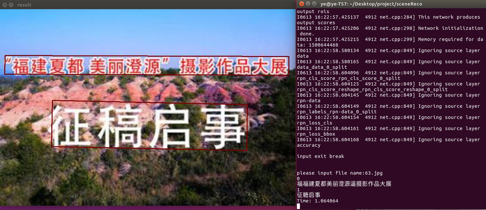
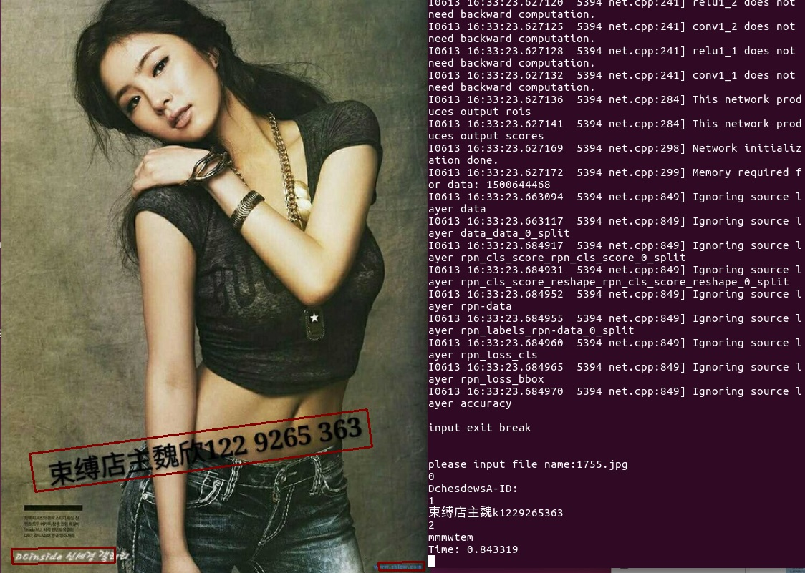

 sceneReco
=================================== 
ctpn+crnn Scene character recognition

# ctpn:

   https://github.com/tianzhi0549/CTPN
	
# crnn:

   https://github.com/bgshih/crnn

# model:

  https://pan.baidu.com/s/19outaxa-vRjPkWaDuTNUPg
  
  copy ctpn_trained_model.caffemodel to ./CTPN.models
  
  https://pan.baidu.com/s/1Tap1VuKRT98ThZo8pzyztw
　https://pan.baidu.com/s/1b5CuFCjXe2gAIuK9Yu4L2g
 
  copy netCRNN63.pth to ./crnn/samples
   
# Run demo

  python demo.py
  
  
# Example image:

